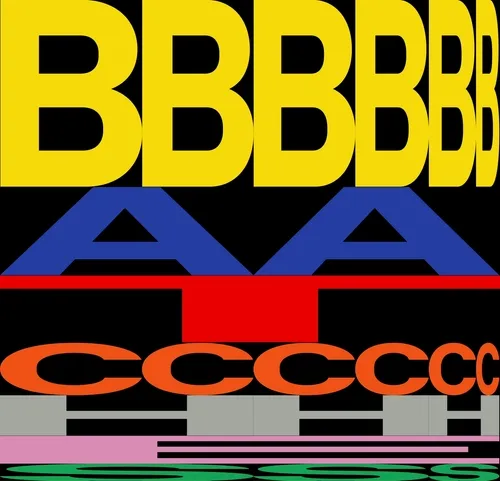

  
  
  

---

## 🇪🇸 Sobre mí

Estudiante de desarrollo enfocado en **blockchain / Web3** y **aplicaciones móviles**.
Me muevo entre **smart contracts** (Solidity, Stellar), **dApps** en TypeScript y apps móviles.
Aprendo construyendo: hackathons, ideathons y proyectos reales.

- 🏆 **Ganador de Base Batch LatAm 2025**
- 🎓 Certificado **CBCA** (Cardano Blockchain Certified Associate)
- 🔭 Trabajando en proyectos Web3 sobre **Stellar** y **Base**
- 🌱 Aprendiendo **Solidity avanzado**, **Soroban** y arquitectura de dApps
- ⚡ Me gusta el punto donde se cruzan blockchain, mobile y buen diseño
- 💬 Pregúntame sobre contratos inteligentes, mini-apps y desarrollo full-stack

## 🇬🇧 About me

Developer student focused on **blockchain / Web3** and **mobile applications**.
I work across **smart contracts** (Solidity, Stellar), TypeScript **dApps** and mobile apps.
I learn by building: hackathons, ideathons and real projects.

- 🏆 **Winner of Base Batch LatAm 2025**
- 🎓 **CBCA** certified (Cardano Blockchain Certified Associate)
- 🔭 Currently building Web3 projects on **Stellar** and **Base**
- 🌱 Learning **advanced Solidity**, **Soroban** and dApp architecture
- ⚡ I enjoy the intersection of blockchain, mobile and good design
- 💬 Ask me about smart contracts, mini-apps and full-stack development

---

## 🛠️ Tech Stack

**Blockchain / Web3**

**Frontend & Mobile**

**Backend & Tools**

---

## 🎓 Certificaciones / Certifications

> **CBCA — Cardano Blockchain Certified Associate**
> 🇪🇸 Certificación oficial de la Cardano Foundation que acredita conocimientos sobre la arquitectura de Cardano, el modelo eUTXO, Ouroboros (Proof of Stake), gobernanza y el ecosistema blockchain.
> 🇬🇧 Official Cardano Foundation certification covering Cardano's architecture, the eUTXO model, Ouroboros (Proof of Stake), governance and the broader blockchain ecosystem.

---

## 🚀 Proyectos destacados / Featured Projects

| Proyecto | Descripción / Description | Stack |
| :--- | :--- | :--- |
| [**Stellar-Blocks**](https://github.com/IanHerez/Stellar-Blocks) | Proyecto de ideathon sobre el ecosistema Stellar · Ideathon project on the Stellar ecosystem | `TypeScript` `Stellar` |
| [**BaseBatches-MiniappCC**](https://github.com/IanHerez/BaseBatches-MiniappCC) | Mini-app construida para Base Batches · Mini-app built for Base Batches | `TypeScript` `Base` |
| [**La-Kiniela-MobileF**](https://github.com/IanHerez/La-Kiniela-MobileF) | App móvil de quinielas · Mobile predictions app | `TypeScript` `Mobile` |
| [**TestHardHat**](https://github.com/IanHerez/TestHardHat) | Experimentos con contratos inteligentes y testing · Smart contract experiments and testing | `Solidity` `Hardhat` |
| [**API-MARVEL**](https://github.com/IanHerez/API-MARVEL) | Consumo de la API de Marvel · Marvel API consumption | `JavaScript` |

---

## 🖼️ Mi colección NFT / My NFT Collection

  <table>
    <tr>
      <td align="center" width="220">
        <a href="https://opensea.io/item/base/0x98d9d7b9556ebc8be8f10cd5b7148e9c8adf744e/476">
           
          <b>🏆 Winner at Base Batch LatAm</b> 
          Base Batches 2025 · Base
        </a>
      </td>
      <td align="center" width="220">
        <a href="https://opensea.io/item/ape_chain/0x75785fc84d68c9848fec6ed602118c129db20367/698633">
           
          <b>🚀 Arbinaut #698633</b> 
          Arbinaut · ApeChain
        </a>
      </td>
    </tr>
  </table>

---

## 📊 GitHub Stats

---

## 🐍 Contribuciones / Contributions

<picture>
  <source media="(prefers-color-scheme: dark)" srcset="https://raw.githubusercontent.com/IanHerez/IanHerez/output/github-contribution-grid-snake-dark.svg" />
  <source media="(prefers-color-scheme: light)" srcset="https://raw.githubusercontent.com/IanHerez/IanHerez/output/github-contribution-grid-snake.svg" />
  
</picture>

---

## 📫 Contacto / Contact

<!-- Añade tus redes / Add your socials:

-->

  

<i>"Construye, rompe, aprende, repite." · "Build, break, learn, repeat."</i>

